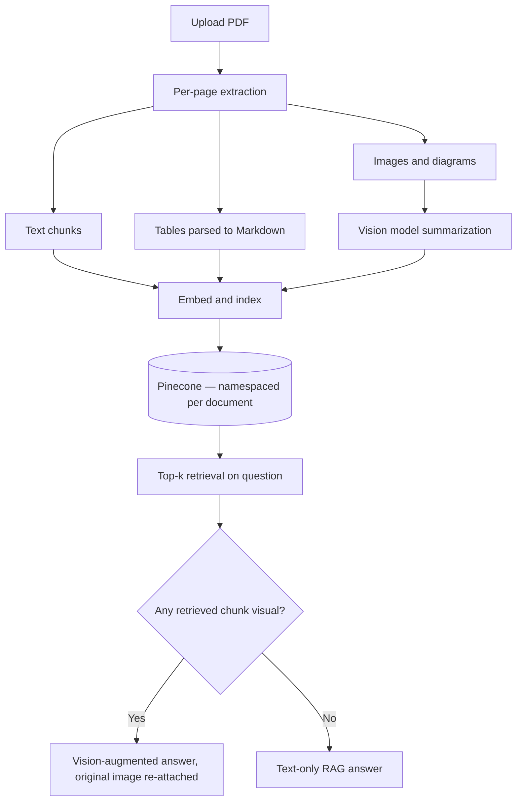

# 📄 Multimodal RAG Document Intelligence System

> Ask questions about any PDF — and get answers grounded in its text, tables, *and* diagrams.

**[Live Demo](https://multimodal-rag-document-intelligence-system-gcxsnyka7lxxsdfqhh.streamlit.app/)**

## Overview

Most RAG projects stop at plain text: chunk a PDF, embed it, retrieve, answer. That works fine until the document that actually matters — a technical report, a tender, an engineering spec — has half its important information sitting inside a table or a diagram that a text-only pipeline simply throws away.

This project is a **multimodal RAG system**: it extracts and reasons over text, tables, *and* images/diagrams from any uploaded PDF, and only calls a vision model when the retrieved evidence actually needs one. It's document-agnostic by design — it works on financial reports, manuals, and contracts as much as it works on the enterprise tendering documents that motivated it.

## Why I built this

During an internship automating tendering and RFP workflows with an in-house LLM agent platform, I ran into a hard limitation: the platform could only work with text. Engineering drawings, technical schematics, and diagrams embedded in tender documents — often where the most decision-critical information lives — were completely invisible to it.

This project is my answer to that gap: a RAG pipeline that treats images as first-class retrievable content, not an afterthought. Tendering is the use case that motivated the design, but the underlying system makes no assumptions about document type.

## What makes this different from a typical RAG demo

- **True multimodal ingestion** — every page is split into text, tables (parsed to structured Markdown, not flattened text), and images, each independently embedded and retrievable.
- **Vision-grounded diagrams** — extracted images/charts/drawings are summarized by a vision model at ingestion time, then the *original image* is re-attached and shown to the LLM at answer time if it's part of the retrieved evidence — the model isn't answering from a caption alone.
- **Modality-aware answer routing** — if none of the retrieved chunks are visual, the system falls back to a cheaper text-only chain instead of always paying for a vision call.
- **Content-addressed document isolation** — each document is namespaced in the vector store by a hash of its own content, so re-uploading the same file reuses its existing index instead of reprocessing, and two different documents can never collide.
- **Stateless core, per-session state** — the expensive shared resources (embedding model, LLM clients, vector store connection) are loaded once and reused; each user's active document and chat history live in their own session, so the app is safe under concurrent users.

## How it works

## Architecture decisions worth knowing

- **Why hash-based namespaces, not filenames** — filenames collide, aren't stable identifiers, and don't tell you if content changed. A content hash does all three for free, and turns "has this document already been indexed?" into a single lookup.
- **Why route between vision and text answers instead of always using vision** — vision calls are slower and more expensive per token than text-only calls. Since most questions about most documents are answerable from text/table context alone, routing on what was actually retrieved keeps the common case cheap without sacrificing accuracy on the cases that need an image.
- **Why the engine holds no per-document state** — an earlier, simpler design stored the active retriever as an attribute on the RAG engine itself. That breaks the moment two users hit a shared deployment at once. Splitting "shared, expensive, stateless resources" from "per-session state" is what makes this safe to actually deploy, not just run locally.
- **Graceful degradation** — if an extracted image is missing at answer time (e.g. ephemeral storage on a redeploy), the system falls back to a text-only answer instead of failing the request.

## Tech stack

| Layer | Choice |
|---|---|
| Orchestration | LangChain |
| LLM + Vision | Groq (text model + vision-capable model) |
| Embeddings | HuggingFace `sentence-transformers` (local, no API cost) |
| Vector store | Pinecone (serverless, namespaced per document) |
| PDF parsing | PyMuPDF (text, tables, embedded images) |
| UI | Streamlit |
| Deployment | Streamlit Community Cloud, Docker |

